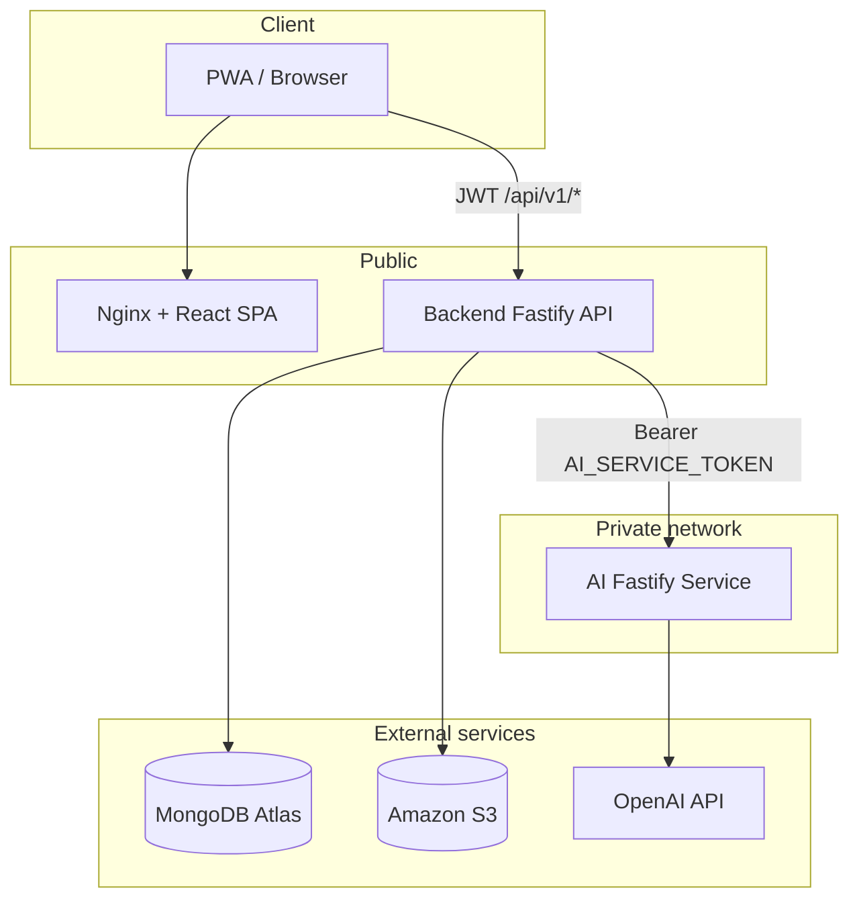

# ComeUp

**ComeUp** is a gym workout and nutrition companion delivered as a progressive web app. It helps athletes and coaches manage training programs, run live workout sessions, track progress, follow structured meal plans, and generate AI-assisted programs and plate visuals.

Production deployment: [https://gym.najahai.com](https://gym.najahai.com)

---

## Table of Contents

- [Overview](#overview)
- [Architecture](#architecture)
- [Technology Stack](#technology-stack)
- [Repository Structure](#repository-structure)
- [Features](#features)
- [iOS / Capacitor](#ios--capacitor)
- [What ComeUp Does Not Include](#what-comeup-does-not-include)
- [Services](#services)
  - [Backend API](#backend-api)
  - [AI Service](#ai-service)
  - [Web UI](#web-ui)
  - [Shared Domain Package](#shared-domain-package)
- [Data & Storage](#data--storage)
- [Security](#security)
- [Environment Variables](#environment-variables)
- [Local Development](#local-development)
- [Docker](#docker)
- [Production Deployment (Dokploy)](#production-deployment-dokploy)
- [Testing](#testing)
- [Roadmap Notes](#roadmap-notes)

---

## Overview

ComeUp is a **monorepo** with three independently deployable services plus a shared TypeScript package:

| Package | Role | Default port |
|---------|------|--------------|
| `ui` | React SPA served by Nginx | `80` (Docker) / `5173` (Vite dev) |
| `backend` | Public REST API, auth, persistence, AI proxy | `4000` |
| `ai` | Private AI microservice (GPT + image generation) | `4100` |
| `shared/domain` | Shared types (`@comeup/domain`) | — |

**Data flow**

1. The browser talks only to the **backend** using JWT authentication.
2. The **backend** persists application data in **MongoDB Atlas** and proxies AI requests to the **ai** service.
3. The **ai** service holds OpenAI credentials and is never exposed to clients.
4. Nutrition photos and AI-generated plate images are stored in **Amazon S3** — not on the host filesystem in production.

---

## Architecture



**Ingress routing (production)**

Dokploy (or another reverse proxy) typically maps:

| Path | Service |
|------|---------|
| `/` | `ui` (static SPA) |
| `/api` | `backend` (strip prefix off or route with full path — match your Dokploy config) |
| `/ai` | `ai` (keep internal when possible) |

The UI container **does not** proxy `/api` in `ui/nginx.conf`. The frontend calls the API using `VITE_API_URL` baked in at build time (e.g. `https://gym.najahai.com/api`).

---

## Technology Stack

### Runtime

- **Node.js** `>=20.19.0` (backend, ai); `>=20.18.0` (ui)
- **`.nvmrc`** recommends Node `22`

### Backend (`backend/`)

| Layer | Technology |
|-------|------------|
| HTTP server | [Fastify](https://fastify.dev/) `^5.2.1` |
| Database ODM | [Mongoose](https://mongoosejs.com/) `^8.10.1` |
| Auth | `@fastify/jwt` `^10.1.0`, bcryptjs `^3.0.2` |
| Validation | [Zod](https://zod.dev/) `^3.24.2` |
| File uploads | `@fastify/multipart` |
| Object storage | `@aws-sdk/client-s3` `^3.758.0` |
| Email | nodemailer `^9.0.3` (password reset) |
| Security | `@fastify/helmet`, `@fastify/cors`, `@fastify/rate-limit` |

### AI service (`ai/`)

| Layer | Technology |
|-------|------------|
| HTTP server | Fastify `^5.2.1` |
| LLM | OpenAI-compatible Chat Completions (`GPT_API_KEY`, default model `gpt-4o-mini`) |
| Image generation | OpenAI Images API (`IMAGE_GEN_API_KEY` or `GPT_API_KEY`, default `gpt-image-1`) |
| Auth | Shared bearer token (`AI_SERVICE_TOKEN`) |

### Web UI (`ui/`)

| Layer | Technology |
|-------|------------|
| Framework | [React](https://react.dev/) `^19.2.3` |
| Build tool | [Vite](https://vitejs.dev/) `^5.4.21` |
| Icons | lucide-react |
| PWA | `manifest.webmanifest` + service worker (`public/sw.js`) |
| Production server | Nginx `1.27-alpine` (Docker) |

### Shared (`shared/domain/`)

- TypeScript package `@comeup/domain` — nutrition types, meal-slot constants, shared enums
- Built before `dev` / `build` in backend, ui, and ai

---

## Repository Structure

```
ComeUp/
├── ui/                    # React PWA
│   ├── src/views/         # Dashboard, Programs, Workout, History, Nutrition, Profile, Admin
│   ├── src/components/    # Session runner, GPT builder, nutrition panels, admin media
│   └── nginx.conf         # Static SPA only (no API proxy)
├── backend/
│   ├── src/routes/        # REST route modules
│   ├── src/models/        # Mongoose schemas
│   ├── src/services/      # S3, AI client, coach plan parser, media resolver, …
│   └── Dockerfile
├── ai/
│   ├── src/routes/        # program, nutrition, health
│   ├── src/services/      # GPT program builder, plate image prompts
│   └── Dockerfile
├── shared/domain/         # @comeup/domain
├── docker-compose.yml     # ui + backend + ai (no bundled MongoDB)
├── .env.example           # Docker Compose root env template
└── docs/                  # App Store privacy/IAP docs + future plans
```

---

## Features

### Authentication & Profile

- Email/password registration and login (JWT, default expiry `7d`)
- Forgot / reset password (SMTP optional; reset link logged to console in dev)
- Profile: age, height, weight, gender, injuries, equipment, preferred training days, session duration, goal, fitness level, workout days per week, rest preferences (auto rest timer, default rest seconds, rest countdown sound)
- Account deletion: authenticated `DELETE /api/v1/account` with `{ confirm: "DELETE", password }` — hard-deletes user-owned data (and best-effort nutrition storage objects)

### Workout Programs

- Create, edit, duplicate, activate, and delete programs
- One active program per user
- Share programs via share codes (`isPublic` flag)
- Import programs from share codes
- **Coach plan import** — paste a coach-written plan; parser previews flagged exercises before save
- Embedded exercise list with sets, reps, rest, schedule, optional nutrition/supplement notes on the program document

### AI Program Creation

Two GPT-powered flows, sharing a **5 messages per user per week** quota (enforced in MongoDB):

| Flow | UI entry | Backend route | AI route |
|------|----------|---------------|----------|
| **GPT Builder** (conversational) | Programs → GPT chat | `/api/v1/ai/program-chat/*` | `/program/generate` |
| **Quick Generate** (single-shot form) | Programs → Quick Generate | `POST /api/v1/ai/workouts/generate` | `/program/generate` |

Both produce a structured program draft that can be saved or auto-activated when the model detects intent.

> **Note:** The AI service also exposes a **rule-based** `POST /workouts/generate` endpoint (deterministic exercise library). The current UI and backend Quick Generate path use **GPT**, not this rule-based endpoint.

### Live Workout Sessions

- Start a session from the active program
- Per-exercise set tracking with rest timer
- Crash-safe local persistence (`localStorage`) with server sync on completion
- Resume interrupted sessions from the dashboard banner
- Exercise images from community catalog, personal overrides, or manual URLs
- Form scores are collected in the schema; the web client currently records `0` (no camera/pose pipeline)

### Progress & Reporting

- **Weekly report** — adherence vs. active program schedule
- **Overview** — six-week history and streak
- **Daily report** — medals, next-session countdown, focus session hint
- **Body measurements** — weight, body fat, circumferences (API supports delete; UI lists and creates)

### Nutrition

Coach-driven meal planning combined with user logging:

| Capability | Description |
|------------|-------------|
| Active meal plan | Template or per-user plan with weekly slots, protein rotation, cheat meal |
| Weigh-in logs | Manual food + weight (grams) per meal slot and date |
| Plate photos | Upload JPEG/PNG/WebP/GIF (max 8 MB) — archived per date/meal slot |
| AI plate image | Generates a visual plate from logged weights via OpenAI Images API |
| Private media | Photos served only through authenticated API routes, not public S3 URLs |

Nutrition UI uses Persian labels for meal slots (`MEAL_SLOT_LABELS_FA` from `@comeup/domain`).

The main web/Capacitor UI is **Persian (FA) + RTL** (`ui/src/i18n/fa.ts`, `index.html` `lang=fa` `dir=rtl`). Profile shows API base URL only in Vite DEV builds.

### Exercise Media

- **Community catalog** — shared GIF/photo per exercise key (admin-managed)
- **Personal overrides** — per-user image per exercise
- **Admin GIF search** — FitnessProgramer.com, free-exercise-db CDN; optional WorkoutX API key
- Meme sources (Giphy/Tenor) disabled by default

### Admin Panel

Available to users whose email is listed in `ADMIN_EMAILS`:

- Overview stats (users, programs, sessions, media)
- User CRUD (delete cascades programs, sessions, media)
- Program management across users
- Exercise media catalog and community GIF tools
- Recent session activity

### Progressive Web App

- Web app manifest and installable icons
- Service worker caches the app shell offline in production
- API responses are **not** cached by the service worker

### Theming

- Light / dark mode toggle (Profile)

---


## iOS / Capacitor

The `ui` app can be wrapped for App Store builds with Capacitor (`appId` `com.najahai.comeup`).

```bash
cd ui
npm install
# Set an absolute HTTPS API origin for native builds (relative `/api` will not work in WKWebView):
#   VITE_API_URL=https://gym.najahai.com/api
npm run build
npm run cap:sync
npm run cap:ios   # opens Xcode
```

Notes:

- `capacitor.config` points `webDir` at `dist` — always rebuild before syncing.
- Camera / photo library usage strings are set in `ui/ios` Info.plist for nutrition plate photos.
- Sign in with Apple, push, and real form/voice/camera features are **not** implemented in this P0.
- **IAP / ComeUp Premium (StoreKit):** `@capgo/native-purchases` + backend `/api/v1/billing/*` — see `docs/IAP_MONETIZATION_PLAN.md`. In Xcode, add the **In-App Purchase** capability. Create ASC subscription products `comeup_premium_monthly` / `comeup_premium_yearly` (group `comeup_premium`). Set `APPLE_IAP_*` on the backend (never commit real `.p8` keys).

### App Store docs (privacy & monetization)

Privacy docs + IAP plan (implementation started on `feat/app-store-storekit-iap`):

| Doc | Purpose |
|-----|---------|
| [`docs/PRIVACY_POLICY_FA.md`](docs/PRIVACY_POLICY_FA.md) | Full Persian privacy policy (host later at e.g. `https://gym.najahai.com/privacy`) |
| [`docs/PRIVACY_POLICY_EN.md`](docs/PRIVACY_POLICY_EN.md) | English privacy policy for App Store Connect |
| [`docs/APP_STORE_PRIVACY_ANSWERS.md`](docs/APP_STORE_PRIVACY_ANSWERS.md) | Checklist mapping Apple App Privacy labels → real data collected |
| [`docs/IAP_MONETIZATION_PLAN.md`](docs/IAP_MONETIZATION_PLAN.md) | StoreKit IAP rules, Free vs Premium, product IDs, Phase B+C status + env vars |

Account deletion (Guideline 5.1.1): in-app Profile flow + authenticated `DELETE /api/v1/account`.

## What ComeUp Does Not Include

These are **not** implemented in the current codebase (some appear only in future docs):

| Feature | Status |
|---------|--------|
| Photo → macro estimation (Cal AI–style food scan) | Not implemented — photos are archive-only; macros come from manual weigh logs |
| Barcode scanning | Not implemented |
| Live camera / pose tracking / real form correction | Not implemented (legacy DB fields default off; not exposed in UI/API) |
| Voice feedback / push notifications | Not implemented (legacy DB fields default off; not exposed in UI/API) |
| Native iOS app | Capacitor iOS shell under `ui/ios` (see iOS / Capacitor below); Android not packaged |
| `POST /ai/recommendations` | Removed (unused proxy + rule-based AI tips) |
| Rule-based Quick Generate | Removed unused AI `/workouts/generate` (UI uses GPT) |
| Reference images for plate generation | Schema field present; not used in generation flow |
| Bundled MongoDB in Docker Compose | Atlas required |

---

## Services

### Backend API

**Base URL:** `http://localhost:4000` (dev) · `https://gym.najahai.com/api` (prod)

**Health**

| Method | Path | Auth |
|--------|------|------|
| `GET` | `/health`, `/api/health` | No — includes MongoDB connection status |

**Auth** — prefix `/api/v1/auth`

| Method | Path | Description |
|--------|------|-------------|
| `POST` | `/register` | Create account |
| `POST` | `/login` | Returns JWT |
| `GET` | `/me` | Current user |
| `POST` | `/forgot-password` | Rate-limited; uniform response |
| `POST` | `/reset-password` | Token from email link |

**Account** — `/api/v1`

| Method | Path | Description |
|--------|------|-------------|
| `DELETE` | `/account` | Hard-delete own account (body: `{ confirm: "DELETE", password }`) |

**Profile** — `/api/v1/profile`

| Method | Path |
|--------|------|
| `PATCH` | `/` |

**Programs** — `/api/v1/programs`

| Method | Path |
|--------|------|
| `GET` | `/` |
| `POST` | `/` |
| `GET` | `/active` |
| `PATCH` | `/:id` |
| `DELETE` | `/:id` |
| `POST` | `/:id/activate` |
| `POST` | `/:id/duplicate` |
| `POST` | `/:id/share` |
| `POST` | `/import/:shareCode` |
| `POST` | `/import-coach-plan/preview` |
| `POST` | `/import-coach-plan` |

**Sessions** — `/api/v1/sessions`

| Method | Path |
|--------|------|
| `POST` | `/start` |
| `PATCH` | `/:id/complete` |
| `GET` | `/` |

**AI proxy** — `/api/v1/ai` (JWT required)

| Method | Path |
|--------|------|
| `GET` | `/program-chat/quota` |
| `POST` | `/program-chat/start` |
| `GET` | `/program-chat/:id` |
| `POST` | `/program-chat/:id/message` |
| `POST` | `/program-chat/:id/convert-to-program` |

**Reports** — `/api/v1/reports`

| Method | Path |
|--------|------|
| `GET` | `/weekly` |
| `GET` | `/overview` |
| `GET` | `/daily` |

**Measurements** — `/api/v1/measurements`

| Method | Path |
|--------|------|
| `GET` | `/` |
| `POST` | `/` |
| `DELETE` | `/:id` |

**Exercise media** — `/api/v1/exercise-media`

| Method | Path |
|--------|------|
| `GET` | `/` |
| `PUT` | `/` |

**Nutrition** — `/api/v1/nutrition`

| Method | Path |
|--------|------|
| `GET` | `/plan/active` |
| `GET` | `/logs?date=` |
| `POST` | `/logs` |
| `DELETE` | `/logs/:id` |
| `GET` | `/logs/summary?from=&to=` |
| `GET` | `/photos?date=` |
| `POST` | `/photos` |
| `GET` | `/plates?date=` |
| `POST` | `/plates/generate` |
| `GET` | `/media/:id` |
| `GET` | `/media/generated/:id` |

**Admin** — `/api/v1/admin` (JWT + admin email)

Users, programs, exercise media, sessions — full CRUD and search endpoints. See `backend/src/routes/admin.ts`.

---

### AI Service

**Base URL:** `http://localhost:4100` (dev) · internal at `https://gym.najahai.com/ai` (prod)

Protected by `Authorization: Bearer <AI_SERVICE_TOKEN>`. CORS is disabled.

| Method | Path | Type |
|--------|------|------|
| `GET` | `/health`, `/ai/health` | Health — reports GPT and image-gen config |
| `POST` | `/program/generate`, `/ai/program/generate` | GPT structured program |
| `POST` | `/nutrition/plates/generate`, `/ai/nutrition/plates/generate` | Plate image from weigh logs |

If `GPT_API_KEY` is unset, GPT routes return `503`. Image generation requires `IMAGE_GEN_API_KEY` or `GPT_API_KEY`.

---

### Web UI

Client-side views (no React Router — custom `useRouter` hook):

| View | Primary capabilities |
|------|---------------------|
| **Dashboard** | Streak, weekly stats, daily medals, session countdown, resume workout, GPT builder entry |
| **Programs** | List/search, CRUD, share/import, coach plan import, Quick Generate, GPT chat |
| **Workout** | Live session runner, rest timer, set toggles, exercise images |
| **History** | Completed sessions |
| **Nutrition** | Meal plan, weigh-in logger, photo archive, AI plate generation |
| **Profile** | Edit profile, measurements, GPT quota, theme, admin link |
| **Admin** | Users, programs, media, activity (admin only) |

**Navigation:** bottom tabs (Dashboard, Programs, Workout, History, Nutrition) + profile button in the header.

---

### Shared Domain Package

```bash
cd shared/domain && npm install && npm run build
```

```ts
import {
  type NutritionPlan,
  type NutritionWeighLog,
  MEAL_SLOT_IDS,
  MEAL_SLOT_LABELS_FA,
  todayPlanDay,
} from '@comeup/domain';
```

---

## Data & Storage

### MongoDB Atlas collections (Mongoose models)

| Model | Purpose |
|-------|---------|
| `User` | Credentials, profile, preferences |
| `Program` | Workout programs (embedded exercises, schedule) |
| `WorkoutSession` | Active and completed sessions |
| `AiConversation` | GPT chat history and draft programs |
| `GptUsage` | Weekly GPT message quota per user |
| `BodyMeasurement` | Body metrics over time |
| `ExerciseMedia` | Per-user exercise image overrides |
| `CommunityExerciseMedia` | Shared exercise images |
| `NutritionPlan` | Meal plan templates and assignments |
| `NutritionWeighLog` | Food weigh entries |
| `NutritionPlatePhoto` | Uploaded plate photo metadata |
| `NutritionGeneratedPlate` | AI-generated plate metadata |

### Amazon S3 layout

All application files live under a single bucket prefix (`AWS_S3_PREFIX`, default `gym`):

```
{AWS_S3_BUCKET}/
└── gym/                          # AWS_S3_PREFIX
    └── nutrition/
        ├── photos/
        │   └── {userId}/
        │       └── {date}_{mealSlot}_{uuid}.{ext}
        └── generated/
            └── {userId}/
                └── {date}_{mealSlot}_{uuid}.png
```

- Objects use `Cache-Control: private`
- Clients download media through `GET /api/v1/nutrition/media/:id` with JWT — not via public S3 URLs
- **Production requires S3** — no user uploads are written to the host disk
- Dev-only escape hatch: `NUTRITION_LOCAL_STORAGE=true` writes to OS temp (never use in Dokploy)

---

## Security

| Concern | Implementation |
|---------|----------------|
| User sessions | JWT (`JWT_SECRET` ≥ 32 chars) |
| Admin access | Email allowlist (`ADMIN_EMAILS`) after JWT verification |
| AI service | Shared secret `AI_SERVICE_TOKEN` (≥ 16 chars); not browser-accessible |
| OpenAI keys | Only in `ai` service environment |
| Passwords | bcrypt (12 rounds); reset tokens hashed at rest |
| HTTP hardening | Helmet on backend and ai |
| Rate limits | Global 120 req/min; forgot-password 5/15 min; plate generate 10/15 min per user |
| Uploads | MIME whitelist; 8 MB max |
| CORS | Configurable origins (`CORS_ORIGIN`); credentials enabled |
| S3 | Private objects; authenticated proxy for downloads |

---

## Environment Variables

### Root `.env.example` (Docker Compose)

| Variable | Purpose |
|----------|---------|
| `UI_PORT`, `BACKEND_PORT`, `AI_PORT` | Host port mappings |
| `VITE_API_URL` | Baked into UI at Docker build time |
| `MONGODB_URI` | MongoDB Atlas connection string |
| `JWT_SECRET`, `JWT_EXPIRES_IN` | Auth |
| `CORS_ORIGIN` | Allowed browser origins |
| `AI_SERVICE_URL`, `AI_SERVICE_TOKEN` | Backend → AI |
| `AWS_*`, `AWS_S3_PREFIX` | S3 storage |

### `backend/.env.example`

| Variable | Required | Notes |
|----------|----------|-------|
| `MONGODB_URI` | Yes | Atlas URI |
| `JWT_SECRET` | Yes | ≥ 32 characters |
| `AI_SERVICE_TOKEN` | Yes | ≥ 16 characters; must match `ai` |
| `AI_SERVICE_URL` | Yes | e.g. `http://localhost:4100` |
| `CORS_ORIGIN` | Yes | Comma-separated origins |
| `ADMIN_EMAILS` | No | Comma-separated admin emails |
| `FRONTEND_URL` | No | Password reset links |
| `SMTP_*`, `EMAIL_FROM` | No | Email delivery |
| `AWS_ACCESS_KEY_ID` | Yes in production | S3 |
| `AWS_SECRET_ACCESS_KEY` | Yes in production | S3 |
| `AWS_REGION` | Yes in production | e.g. `eu-central-1` |
| `AWS_S3_BUCKET` | Yes in production | e.g. `iapp` |
| `AWS_S3_PREFIX` | No | Default `gym` |
| `AWS_S3_PUBLIC_BASE_URL` | No | Optional CloudFront for other public assets |
| `NUTRITION_LOCAL_STORAGE` | No | Dev only — ephemeral local files |
| `WORKOUTX_API_KEY`, `GIPHY_API_KEY`, `TENOR_API_KEY` | No | Optional media search |
| `GIF_SEARCH_ENABLE_MEME_SOURCES` | No | Default `false` |

### `ai/.env.example`

| Variable | Required | Notes |
|----------|----------|-------|
| `AI_SERVICE_TOKEN` | Yes | Must match backend |
| `GPT_API_KEY` | For GPT features | OpenAI or compatible |
| `GPT_MODEL` | No | Default `gpt-4o-mini` |
| `GPT_BASE_URL` | No | Default `https://api.openai.com/v1` |
| `IMAGE_GEN_API_KEY` | For plate images | Falls back to `GPT_API_KEY` |
| `IMAGE_GEN_MODEL` | No | Default `gpt-image-1` |

### UI build-time

| Variable | Notes |
|----------|-------|
| `VITE_API_URL` | API base URL; dev default `http://localhost:4000` when unset |

---

## Local Development

### Prerequisites

- Node.js 20+
- MongoDB Atlas database (or compatible URI)
- AWS S3 credentials (recommended; or `NUTRITION_LOCAL_STORAGE=true` for offline dev)

### Setup

```bash
cp backend/.env.example backend/.env
cp ai/.env.example ai/.env
# Edit both files — use the same AI_SERVICE_TOKEN
```

Install and build all packages:

```bash
cd shared/domain && npm install && npm run build

cd ../../backend && npm install && npm run build
cd ../ai && npm install && npm run build
cd ../ui && npm install && npm run build
```

Run services in separate terminals:

```bash
cd ai && npm run dev          # :4100
cd backend && npm run dev     # :4000
cd ui && npm run dev          # :5173
```

### Useful scripts

| Package | Command | Purpose |
|---------|---------|---------|
| backend | `npm run dev` | Watch mode with tsx |
| backend | `npm test` | Unit tests |
| backend | `npm run typecheck` | TypeScript check |
| ai | `npm run dev` | Watch mode |
| ai | `npm test` | Unit tests |
| ui | `npm run dev` | Vite dev server |
| ui | `npm test` | Session engine tests |
| ui | `npm run lint` | ESLint |

---

## Docker

```bash
cp .env.example .env
# Set MONGODB_URI, JWT_SECRET, AI_SERVICE_TOKEN, and all AWS_* variables
docker compose up --build
```

| Service | Container port | Default host port |
|---------|----------------|-------------------|
| ui | 80 | 3000 |
| backend | 4000 | 4000 |
| ai | 4100 | 4100 |

- **No MongoDB container** — set `MONGODB_URI` to Atlas
- Backend health check requires MongoDB `connected`
- UI waits for backend; backend waits for ai
- Set `VITE_API_URL` before build if the API is not at `/api` on the same host

Each service has a multi-stage `Dockerfile` that builds `@comeup/domain` first. `nixpacks.toml` files exist as an alternative builder but **Dockerfile is recommended** for faster, reproducible deploys.

---

## Production Deployment (Dokploy)

Deploy as **three separate Dokploy applications** from the monorepo root.

**Recommended deploy order:** `ai` → `backend` → `ui`

### UI service

| Setting | Value |
|---------|-------|
| Build context | `/` (repository root) |
| Dockerfile | `ui/Dockerfile` |
| Port | `80` |
| Build arg | `VITE_API_URL=https://gym.najahai.com/api` |

### Backend service

| Setting | Value |
|---------|-------|
| Build context | `/` |
| Dockerfile | `backend/Dockerfile` |
| Port | `4000` |

**Required environment variables:**

```env
NODE_ENV=production
MONGODB_URI=mongodb+srv://...
JWT_SECRET=<long-random-secret>
CORS_ORIGIN=https://gym.najahai.com
FRONTEND_URL=https://gym.najahai.com
AI_SERVICE_URL=https://gym.najahai.com/ai
AI_SERVICE_TOKEN=<shared-with-ai>
BIND_HOST=0.0.0.0
ADMIN_EMAILS=you@example.com

AWS_ACCESS_KEY_ID=...
AWS_SECRET_ACCESS_KEY=...
AWS_REGION=eu-central-1
AWS_S3_BUCKET=iapp
AWS_S3_PREFIX=gym
```

Optional: `SMTP_*` for password reset email, `AWS_S3_PUBLIC_BASE_URL` for CloudFront-backed public assets.

**Do not set** `NUTRITION_LOCAL_STORAGE` in production.

### AI service

| Setting | Value |
|---------|-------|
| Build context | `/` |
| Dockerfile | `ai/Dockerfile` |
| Port | `4100` |

```env
NODE_ENV=production
AI_SERVICE_TOKEN=<same-as-backend>
BIND_HOST=0.0.0.0
GPT_API_KEY=sk-...
GPT_MODEL=gpt-4o-mini
IMAGE_GEN_API_KEY=sk-...   # or omit to reuse GPT_API_KEY
IMAGE_GEN_MODEL=gpt-image-1
```

Keep the AI service on a private network when Dokploy allows it. Do **not** set `VITE_API_URL` on the AI service.

### Production checklist

- [ ] HTTPS on the public domain (`gym.najahai.com`)
- [ ] Long random `JWT_SECRET` and `AI_SERVICE_TOKEN`
- [ ] MongoDB Atlas IP allowlist includes deployment servers
- [ ] S3 IAM credentials scoped to `gym/*` prefix
- [ ] GPT and image API keys only on the `ai` service
- [ ] CORS limited to the production frontend origin

---

## Testing

| Location | Command | Coverage |
|----------|---------|----------|
| `backend/src/services/exerciseDictionary.test.ts` | `cd backend && npm test` | Exercise classification |
| `backend/src/services/exerciseGifSearch.test.ts` | `cd backend && npm test` | GIF search ranking |
| `ui/src/lib/sessionEngine.test.ts` | `cd ui && npm test` | Session state machine |
| `ai/src/services/nutritionPlateImage.test.ts` | `cd ai && npm test` | Plate image prompt builder |

There is no bundled E2E or CI pipeline in this repository yet.

---

## Roadmap Notes

Documented future direction (not implemented):

- **`docs/IAP_MONETIZATION_PLAN.md`** — StoreKit Premium plan + implementation notes (`APPLE_IAP_*`, paywall, verify routes)
- **`docs/production-motion-tracking-plan.md`** — native mobile, camera pose tracking, real-time form feedback
- Deeper Cal AI–style nutrition (photo macros, barcode, daily calorie targets)
- Unified dashboard combining workout adherence and nutrition in one view

The current `ai` service contract is designed so additional providers (LLM, vision, pose models) can be added behind the same internal routes without exposing keys to clients.

---

## License

Private project. All rights reserved unless otherwise specified by the repository owner.
